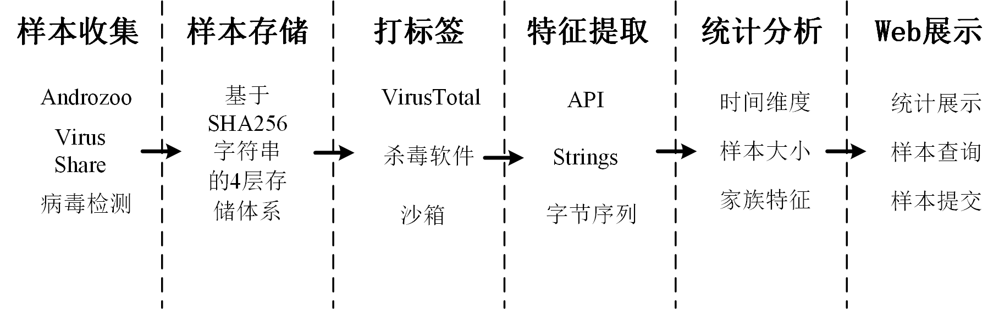

# nkrepo: Malware repository
#### NKAMG，Nankai Anti-Malware Group

#### 

## 恶意样本库查询系统
收集大量样本存储到样本库，并对样本进行国内外检测器检测进行打标签.
https://github.com/nkiszhi/nkrepo/blob/master/README.md
## 文件检测
通过大量样本训练模型，来检测样本的可疑度，并进行国内外主流检测引擎检测（数据来源于互联网数据收集）

## 域名检测
通过大量样本训练多模型协同检测，基于可信度判断域名。

## 样本检索
通过sha256搜索下载样本
通过家族搜索下载样本
通过平台搜索下载样本
通过类型搜索下载样本

## TodoList
- [ ] 长期：持续收集样本，进行打标签入库操作
- [ ] 待完善：MYSQL数据库结构完善
- [ ] 待完善：样本检测界面更新
- [ ] 待完善：数据展示界面数据自动获取
